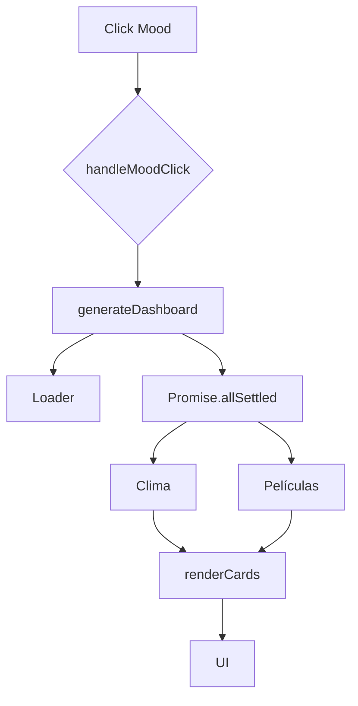

# Documentación Técnica: Integración de APIs en Mood Culture

## Objetivo del Sistema
El objetivo principal de **Mood Culture** es enriquecer la experiencia del usuario generando un dashboard de contenido multimedia y contextual en tiempo real. Al seleccionar un estado de ánimo (*mood*), la aplicación consume múltiples APIs públicas para obtener y mostrar información dinámica sobre:

- **Clima** actual de una ciudad aleatoria.
- **Películas** recomendadas según el género asociado al *mood*.
- **Música** (bandas sonoras o artistas) relacionada con el estado de ánimo.
- **Libros** que coinciden con palabras clave del *mood*.

---

## 2️ Arquitectura de Configuración (Centralización de Endpoints)
Para garantizar la mantenibilidad del código, todas las URLs base de las APIs se centralizan en un único objeto `APIS`. Esto evita la repetición de cadenas de texto y facilita la actualización de endpoints.

```javascript
const APIS = {
  weather: "https://api.open-meteo.com/v1/forecast",
  movies: "https://api.sampleapis.com/movies",
  books: "https://openlibrary.org/search.json",
  music: "https://api.sampleapis.com/music"
};
```

### Ventajas:

- Mantenibilidad: Cambiar una URL solo requiere modificar una línea.

- Legibilidad: El código es más fácil de entender al referenciar constantes con nombre.

- Escalabilidad: Añadir una nueva API es tan simple como agregar una nueva propiedad al objeto.

## 3️ Flujo de Llamada Completo
El proceso se inicia con la interacción del usuario y sigue un flujo controlado para garantizar la robustez.




### 3.1. Paso a Paso
Evento de Usuario: Se captura el clic mediante un EventListener.

```javascript
button.addEventListener("click", handleMoodClick);
Función Generadora: generateDashboard(moodKey)
```
 se encarga de:

- Cambiar el fondo visual de la interfaz.

- Seleccionar una ciudad aleatoria para la API del clima.

- Activar un indicador de carga (loader).

- Ejecutar las peticiones a las APIs.

Peticiones Simultáneas: Se utiliza Promise.allSettled() para lanzar todas las peticiones a la vez. Esto asegura que el fallo de una API no bloquee la ejecución de las demás.

## 4️ APIs Específicas y Transformación de Datos
### 4.1. API de Clima (Open-Meteo)
- Endpoint: ?latitude=X&longitude=Y&current_weather=true

- Proceso: Se toman las coordenadas de la ciudad seleccionada aleatoriamente y se realiza el fetch.

- Ejemplo de respuesta transformada:

```json
{
  "temperature": "22°C",
  "wind": "10 km/h",
  "description": "clima agradable"
}
```

### 4.2. API de Películas (SampleAPIs)
- Endpoint: /movies/{genre}

- Proceso: El mood del usuario se traduce en un género cinematográfico. Se obtiene una lista y se selecciona una película aleatoria para mostrar.

### 4.3. API de Música (SampleAPIs)
- Endpoint: /music/{genre}

- Proceso: Similar al de películas, el mood determina un género musical. La respuesta se transforma en un objeto simple para alimentar las tarjetas de la UI.

### 4.4. API de Libros (Open Library)
- Endpoint: /search.json?q={tema}&limit=1

- Proceso: El mood se convierte en una palabra clave de búsqueda. Se extrae el primer resultado y se genera dinámicamente la URL de la portada.

- URL de Portada:

text
https://covers.openlibrary.org/b/id/{cover_i}-L.jpg
## 5️ Manejo de Errores y Fallbacks
La experiencia de usuario (UX) es prioritaria. Por eso, cada función que consume una API está envuelta en un bloque try/catch. Si una petición falla (por red, error del servidor, etc.), se ejecuta un fallback local.

```javascript
async function fetchMovies(mood) {
  try {
    const response = await fetch(`${APIS.movies}/${mood}`);
    // ... lógica de éxito
  } catch (error) {
    console.error("Error fetching movies, using fallback:", error);
    return getFallbackMovies(mood); // Datos locales de respaldo
  }
}
```
### Garantías:

- Robustez: La aplicación nunca muestra una pantalla de error en blanco.

- Contenido: Siempre hay información visible para el usuario, manteniendo la dinámica de la aplicación.

## 6️ Renderizado Final
Una vez que todos los datos han sido obtenidos (o se han resuelto los fallbacks), se pasan a la función renderCards(data).

Esta función es la única responsable de manipular el DOM para construir las tarjetas HTML.

La página no se recarga en ningún momento; todo el proceso es asíncrono y dinámico gracias a JavaScript.

Robustez: Implementación de fallbacks locales y manejo de errores por API.

UX: Activación de loaders durante la carga y actualización dinámica del contenido sin recargas de página.

###Arquitectura Conceptual
UI (Evento) → Controlador (Mood) → Servicios (APIs) → Procesamiento (Transformación) → Render (DOM)

## Conclusión
La integración de APIs en Mood Culture demuestra un enfoque sólido y profesional. El sistema es capaz de consumir fuentes de datos heterogéneas de manera simultánea, tolerante a fallos y eficiente, resultando en una aplicación interactiva, escalable y con una base de código limpia y mantenible.