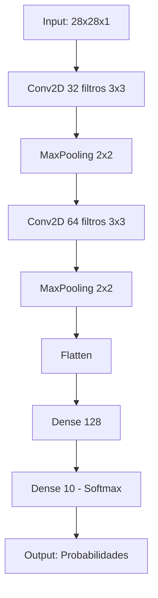
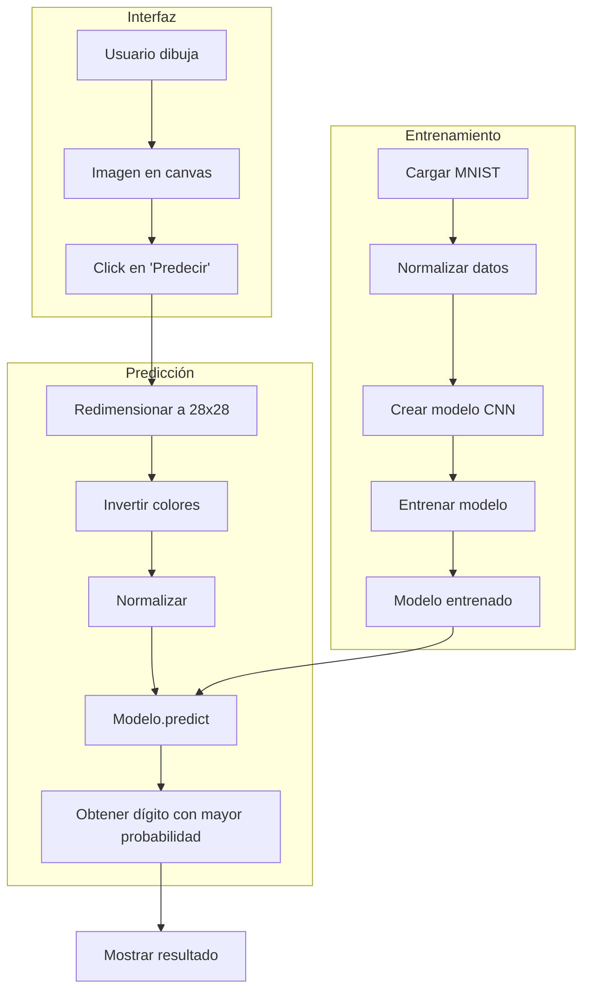

# 🧠 Reconocedor de Dígitos Manuscritos con MNIST y TensorFlow


Aplicación interactiva que permite dibujar números del 0 al 9 y predecirlos en tiempo real usando una **Red Neuronal Convolucional (CNN)** entrenada con el dataset MNIST.


## 📋 Tabla de Contenidos
- [Características](#-características)
- [Dataset](#-dataset-mnist)
- [Librerías Utilizadas](#-librerías-utilizadas)
- [Arquitectura del Modelo](#-arquitectura-del-modelo)
- [Flujo del Programa](#-flujo-del-programa)
- [Resultados](#-resultados)


## ✨ Características

- ✅ **Interfaz gráfica intuitiva** para dibujar números con el mouse
- ✅ **Modelo CNN entrenado** con el dataset MNIST (precisión ~99%)
- ✅ **Predicción en tiempo real** con porcentaje de confianza
- ✅ **Preprocesamiento automático** de la imagen dibujada
- ✅ **Botón de limpieza** para borrar y dibujar nuevamente

## 📊 Dataset MNIST

El **MNIST (Modified National Institute of Standards and Technology)** es considerado el "Hello World" del deep learning.

| Característica | Descripción |
|:---|:---|
| **Tamaño** | 70,000 imágenes |
| **Distribución** | 60,000 entrenamiento / 10,000 prueba |
| **Formato** | 28x28 píxeles, escala de grises |
| **Clases** | 10 (dígitos del 0 al 9) |
| **Autores** | Yann LeCun, Corinna Cortes, Christopher Burges |

**Ejemplos del dataset:**
0 0 0 0 0 0 0 0 0 0
0 0 0 0 0 0 0 0 0 0
0 0 0 0 1 1 1 0 0 0 <- Los píxeles blancos (255)
0 0 0 1 1 1 1 0 0 0 forman los dígitos
0 0 1 1 0 0 1 1 0 0
0 0 1 1 0 0 1 1 0 0
0 0 0 0 0 0 0 0 0 0

text

## 📚 Librerías Utilizadas

| Librería | Versión | Propósito |
|:---|:---:|:---|
| **TensorFlow** | 2.x | Framework de deep learning para crear y entrenar la CNN |
| **Keras** | 2.x | API de alto nivel para construir redes neuronales |
| **NumPy** | 1.19+ | Manipulación de arrays y operaciones matemáticas |
| **Tkinter** | Built-in | Creación de la interfaz gráfica de usuario |
| **Pillow (PIL)** | 8.0+ | Procesamiento de imágenes (redimensionar, invertir, dibujar) |

**Instalación de dependencias:**
```bash
pip install tensorflow numpy pillow
Nota: Tkinter viene incluido con Python por defecto.
```
# Arquitectura del Modelo
La red neuronal convolucional (CNN) tiene la siguiente estructura:


Capas en detalle:
Capa	Tipo	Tamaño de salida	Parámetros	Función
1	Conv2D	26x26x32	320	Detecta bordes, esquinas, texturas básicas
2	MaxPooling2D	13x13x32	0	Reduce dimensionalidad, mantiene características
3	Conv2D	11x11x64	18,496	Detecta patrones más complejos
4	MaxPooling2D	5x5x64	0	Segunda reducción
5	Flatten	1600	0	Convierte matriz 2D en vector
6	Dense	128	204,928	Capa totalmente conectada para clasificación
7	Dense (Salida)	10	1,290	Probabilidades para cada dígito
Total de parámetros entrenables: ~224,000

🔄 Flujo del Programa
Diagrama de flujo general:



## Explicación paso a paso:
1️⃣ Entrenamiento del modelo
Se cargan las 70,000 imágenes del dataset MNIST

Se normalizan los píxeles (0-255 → 0-1)

Se crea la arquitectura CNN

Se entrena durante 3 épocas

El modelo queda listo en memoria para predecir

# 2 Interacción del usuario
El usuario dibuja un número en el canvas de 280x280 píxeles

Cada trazo se guarda en dos lugares:

Visualmente en el canvas (para que el usuario vea)

En una imagen PIL en memoria (para procesar después)

# 3️ Predicción 
## Procesamiento de la imagen
```python
img = self.image.resize((28,28))      # Redimensionar
img = ImageOps.invert(img)             # Invertir colores
img_array = np.array(img) / 255.0      # Normalizar
img_array = img_array.reshape(1,28,28,1)  # Ajustar formato
```

## Predicción
```python
prediction = model.predict(img_array)
number = np.argmax(prediction)          # Dígito predicho
confidence = np.max(prediction) * 100    # Confianza
```

## Visualización del resultado
Se muestra el dígito predicho

Se muestra el porcentaje de confianza

 - **Ejemplo:** "Predicción: 7 (98.45%)"

### Instalación y Ejecución
Requisitos previos
Python 3.8 o superior

pip (gestor de paquetes)

Pasos de instalación
Clonar el repositorio

bash
git clone https://github.com/...

bash
# Windows
python -m venv venv
venv\Scripts\activate

# Linux/Mac
python3 -m venv venv
source venv/bin/activate
Instalar dependencias

bash
pip install tensorflow numpy pillow
Ejecutar la aplicación

bash
python mnist_draw_predict.py
Verificación de instalación
python
# Script de verificación rápida
```import tensorflow as tf
print(f"TensorFlow version: {tf.__version__}")
print(f"GPU disponible: {tf.config.list_physical_devices('GPU')}")
```

# 📈 Resultados

## Métricas de entrenamiento

| Época | Pérdida (Loss) | Precisión (Accuracy) |
|-------|----------------|----------------------|
| 1     | 0.1452         | 95.67%               |
| 2     | 0.0421         | 98.72%               |
| 3     | 0.0289         | 99.14%               |

---

## Ejemplos de predicción

| Dibujo            | Predicción | Confianza |
|------------------|------------|-----------|
| 7 manuscrito     | 7          | 98.5%     |
| 3 manuscrito     | 3          | 95.2%     |
| 0 manuscrito     | 0          | 99.8%     |
